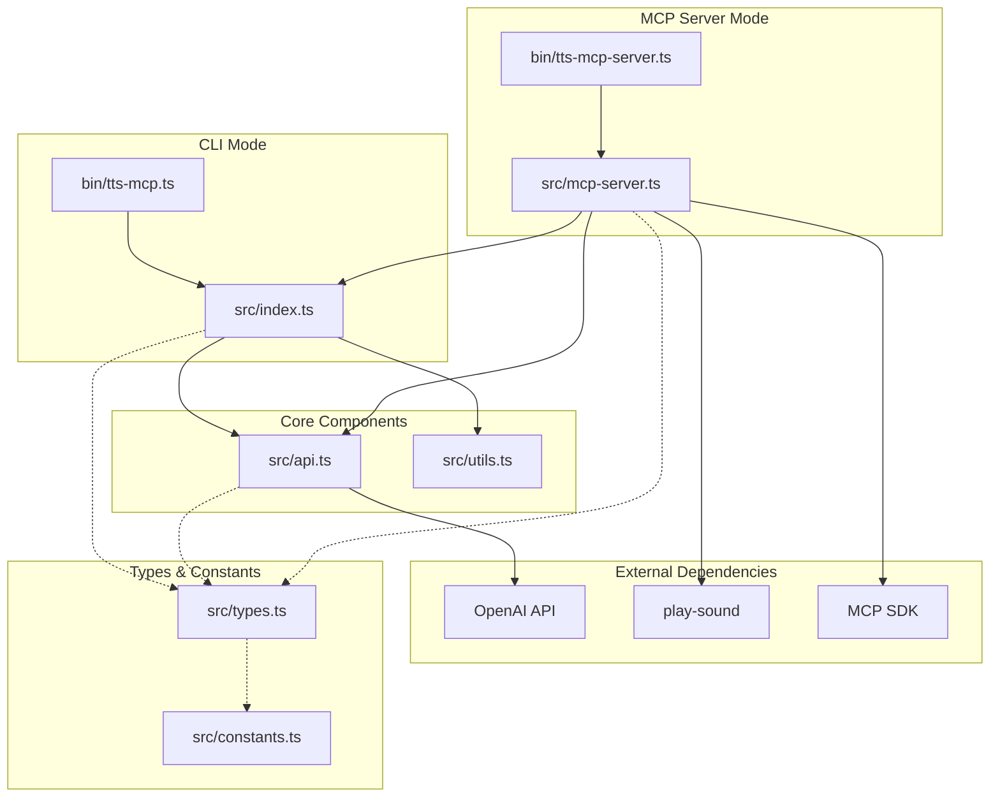

# System Patterns: tts-mcp

## System Architecture



## Key Components

### 1. CLI Utility (`bin/tts-mcp.ts`)
- **Responsibility**: Provides command-line interface for converting text to speech files
- **Patterns**: Command pattern for processing user inputs
- **Key Operations**:
  - Parse command-line arguments
  - Validate inputs
  - Execute text-to-speech conversion
  - Save output to file

### 2. MCP Server (`bin/tts-mcp-server.ts`, `src/mcp-server.ts`)
- **Responsibility**: Implements Model Context Protocol for integration with Claude Desktop
- **Patterns**:
  - Server pattern for handling MCP requests
  - Factory pattern for creating server instances
  - Observer pattern for handling events
- **Key Operations**:
  - Initialize and start MCP server
  - Register tools (text-to-speech)
  - Handle text-to-speech requests
  - Play generated audio
  - Log operations

### 3. Core Logic (`src/index.ts`, `src/api.ts`)
- **Responsibility**: Core text-to-speech functionality
- **Patterns**:
  - Module pattern for organizing functionality
  - Adapter pattern for OpenAI API integration
- **Key Operations**:
  - Initialize OpenAI client
  - Validate TTS options
  - Execute text-to-speech API calls
  - Process and save audio output

### 4. Utilities (`src/utils.ts`)
- **Responsibility**: Helper functions and validation
- **Key Operations**:
  - Validate input options (voice, model, format)
  - File operations (read/write)
  - Error handling

## Data Flow

### CLI Flow
1. User invokes CLI with text and options
2. CLI validates inputs and constructs options object
3. Core module executes text-to-speech conversion
4. API module makes OpenAI API call
5. Audio file is saved to specified location

### MCP Server Flow
1. MCP client (e.g., Claude Desktop) sends request
2. MCP server processes request and extracts text
3. Server calls core text-to-speech functionality
4. Audio is generated via OpenAI API
5. Audio is saved to temporary file
6. Audio is played back to user
7. Temporary file is cleaned up

## Design Patterns

### 1. Factory Pattern
Used in server creation and initialization, abstracting the complexity of server setup.

```typescript
// Example from mcp-server.ts
async function createMcpServer(config: MCPServerConfig): Promise<McpServer> {
  // Configuration and setup...
  const server = new McpServer({
    name: "tts-mcp",
    version: "1.1.0",
    capabilities: { tools: {} }
  });

  // Register tools...
  return server;
}
```

### 2. Adapter Pattern
Used to adapt the OpenAI API to the application's needs:

```typescript
// Example from api.ts
export async function textToSpeech(options: TTSOptions): Promise<void> {
  const client = initializeClient(options.apiKey);

  // Transform our options to OpenAI API format
  const response = await client.audio.speech.create({
    model: options.model,
    voice: safeVoice,
    input: options.text,
    speed: options.speed,
    response_format: options.format,
    ...(options.instructions ? { instructions: options.instructions } : {})
  });

  // Process response...
}
```

### 3. Command Pattern
Used in CLI implementation to encapsulate operations:

```typescript
// Conceptual example from bin/tts-mcp.ts
// Command-line options are converted to execution commands
program
  .option('-t, --text <text>', 'Text to convert')
  .option('-o, --output <path>', 'Output path')
  // ...more options
  .action(async (options) => {
    // Execute the command with options
    await run(options);
  });
```

## Error Handling Strategy
- **Input Validation**: Validate all inputs before API calls
- **Safe Defaults**: Provide fallbacks for missing or invalid options
- **Explicit Error Messages**: Clear error messages with resolution steps
- **Logging**: Detailed logs for troubleshooting
- **Cleanup**: Ensure temporary files are cleaned up even after errors

## Extension Points
1. **Voice Selection**: Easy to add new voices as OpenAI expands offerings
2. **Output Formats**: Support for new audio formats can be added
3. **Model Selection**: New TTS models can be integrated
4. **Additional Tools**: The MCP server can be extended with new tools
5. **Language Support**: Could be extended for multi-language support
